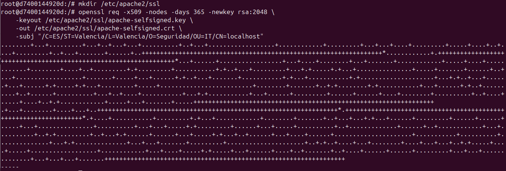
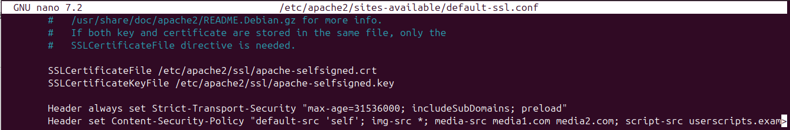
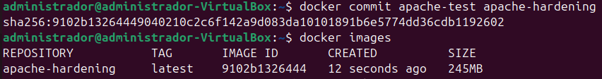
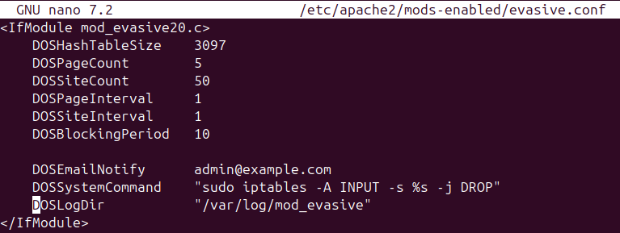
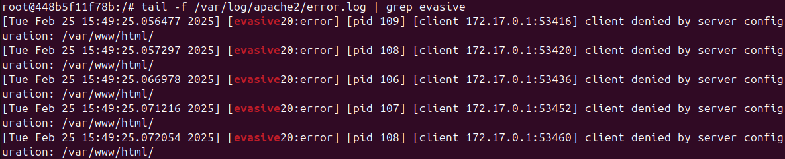
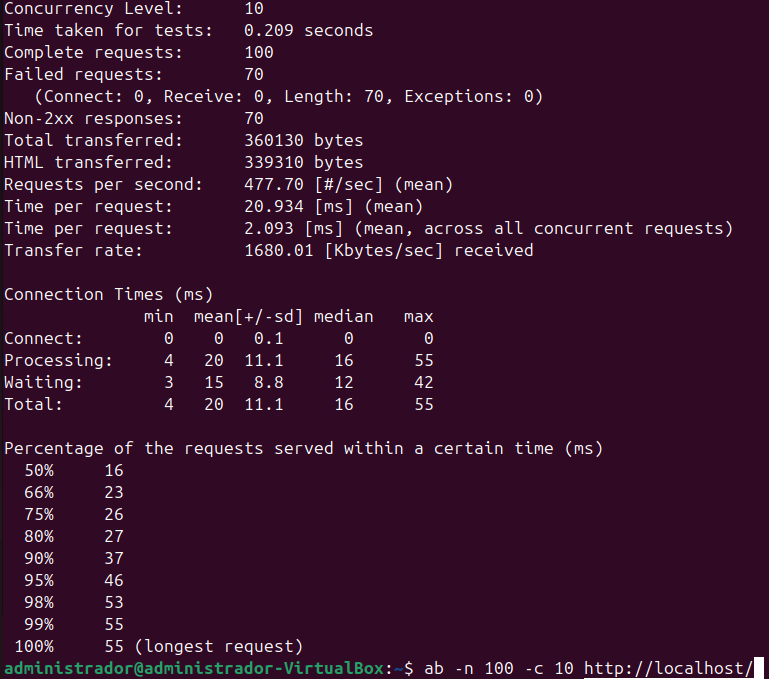

# RA3_1

## Introduction

La presente documentación cubre la configuración de seguridad para Apache dentro de un contenedor Docker, implementando distintas prácticas de hardening para reforzar la seguridad del servidor en un entorno de producción segura. La seguridad en la puesta en producción es un aspecto crítico para garantizar la integridad, disponibilidad y confidencialidad de los servicios web. En este contexto, se aplicarán configuraciones avanzadas para mitigar riesgos como ataques de ejecución remota de código (RCE), Cross-Site Scripting (XSS), inyección SQL (SQLi), ataques de denegación de servicio (DDoS) y otras amenazas documentadas en el OWASP Top 10.

Para ello, se implementarán estrategias de seguridad en capas que incluyen políticas de seguridad de contenido (CSP), encabezados de seguridad estrictos (HSTS), firewalls de aplicaciones web (WAF) y módulos específicos de Apache como `mod_security` y `mod_evasive`. Además, se aplicarán restricciones en la configuración de Apache para evitar fugas de información y reforzar la resistencia ante ataques dirigidos al servidor web.

---

## Tasks

* [Práctica 1: CSP](#practica-1-csp)
* [Práctica 2: Web Application Firewall](#practica-2-web-application-firewall)
* [Práctica 3: OWASP](#practica-3-owasp)
* [Práctica 4: Evitar ataques DDOS](#practica-4-evitar-ataques-ddos)

---

## **📌 Práctica 1: Content Security Policy (CSP)**

### **Introducción**
Content Security Policy (CSP) es un mecanismo de seguridad que permite definir reglas estrictas sobre qué contenido puede ser cargado en una página web. Esto ayuda a mitigar ataques como **Cross-Site Scripting (XSS)** e inyección de contenido malicioso, protegiendo la integridad del sitio y la información del usuario.  

En esta práctica, se ha implementado CSP en Apache dentro de un contenedor Docker para reforzar la seguridad en la entrega de contenido web.

---

### **📌 Configuración de CSP en Apache**
Para aplicar **CSP** en Apache, se ha configurado la directiva en el archivo de configuración del sitio seguro (`default-ssl.conf`):

```apache
Header set Content-Security-Policy "default-src 'self'; img-src *; media-src media1.com media2.com; script-src userscripts.example.com"
```

📌 **Explicación de la configuración:**  
- **`default-src 'self'`** → Solo permite cargar contenido desde el mismo dominio (evita scripts externos).  
- **`img-src *`** → Permite la carga de imágenes desde cualquier origen.  
- **`media-src media1.com media2.com`** → Los archivos de medios solo pueden provenir de `media1.com` y `media2.com`.  
- **`script-src userscripts.example.com`** → Solo permite ejecutar scripts desde `userscripts.example.com`.  

---

### **📌 Implementación en Docker**
Para hacer esta configuración **persistente y fácilmente replicable**, se ha definido en un `Dockerfile` ubicado en:  
📂 `assets/CSP/Dockerfile`  

Este Dockerfile incluye la configuración de **Apache con CSP habilitado** y la generación de un certificado SSL autofirmado para asegurar la comunicación HTTPS.

📌 **La imagen resultante con esta configuración está disponible en Docker Hub:**  
👉 **[apache-hardening en Docker Hub](https://hub.docker.com/r/pps10711239/pr1)**  

---

### **📌 Generación de un certificado SSL autofirmado**
Para habilitar HTTPS en Apache y aplicar CSP de manera segura, se generó un certificado SSL autofirmado utilizando OpenSSL.  
Se ejecutó el siguiente comando dentro del contenedor:

```sh
mkdir /etc/apache2/ssl
openssl req -x509 -nodes -days 365 -newkey rsa:2048 \
  -keyout /etc/apache2/ssl/apache-selfsigned.key \
  -out /etc/apache2/ssl/apache-selfsigned.crt \
  -subj "/C=ES/ST=Valencia/L=Valencia/O=Seguridad/OU=IT/CN=localhost"
```

📌 **Esto crea un certificado válido por 1 año** y lo almacena en `/etc/apache2/ssl/`.

---

### **📌 Modificación del VirtualHost para HTTPS**
En el archivo `/etc/apache2/sites-available/default-ssl.conf` se añadieron las siguientes líneas para configurar **SSL y CSP**:

```apache
SSLCertificateFile /etc/apache2/ssl/apache-selfsigned.crt
SSLCertificateKeyFile /etc/apache2/ssl/apache-selfsigned.key

Header always set Strict-Transport-Security "max-age=31536000; includeSubDomains; preload"
Header set Content-Security-Policy "default-src 'self'; img-src *; media-src media1.com media2.com; script-src userscripts.example.com"
```

📌 **Explicación:**  
✔ **SSL:** Se especifica el uso del certificado y la clave privada generados.  
✔ **HSTS (`Strict-Transport-Security`)**: Obliga a los navegadores a utilizar HTTPS en futuras conexiones.  
✔ **CSP:** Se aplica la política de seguridad establecida previamente.

---

### **📌 Verificación de CSP**
Para verificar que CSP se está aplicando correctamente, se utilizó **`curl`** con los siguientes comandos:

```sh
curl -I http://localhost
curl -I https://localhost --insecure
```

📌 **Salida esperada:**  
```
HTTP/1.1 200 OK
Strict-Transport-Security: max-age=31536000; includeSubDomains; preload
Content-Security-Policy: default-src 'self'; img-src *; media-src media1.com media2.com; script-src userscripts.example.com
```

Esto confirma que **CSP está activo y funcionando correctamente** tanto en HTTP como en HTTPS.

---

### **📌 Evidencias (Capturas de pantalla)**
Para documentar el proceso, se han incluido capturas de pantalla de cada paso:

📌 **📷 Captura 1: Creación de la imagen Docker con CSP configurado**  


📌 **📷 Captura 2: Generación del certificado SSL con OpenSSL**  


📌 **📷 Captura 3: Configuración del archivo `default-ssl.conf`**  


📌 **📷 Captura 4: Verificación de CSP y HSTS con `curl`**  


---
## Práctica 2: Web Application Firewall (WAF)

### Introducción

Un Web Application Firewall (WAF) es un sistema de seguridad que supervisa, filtra y bloquea el tráfico HTTP para proteger aplicaciones web de ataques como inyección SQL (SQLi), Cross-Site Scripting (XSS) y falsificación de peticiones entre sitios (CSRF). En esta práctica, se ha configurado Apache con **ModSecurity**, un firewall de aplicaciones web de código abierto ampliamente utilizado.

### Configuración de WAF en Apache

Para implementar WAF en Apache, se han seguido estos pasos:
1. Instalación del módulo ModSecurity y las reglas de OWASP Core Rule Set (CRS).
2. Configuración de ModSecurity para bloquear ataques en lugar de solo detectarlos.
3. Implementación de un archivo PHP (`post.php`) en el DocumentRoot para probar reglas de seguridad.

### Implementación en Docker

El `Dockerfile` con esta configuración se encuentra en la carpeta `assets/WAF` dentro del repositorio. Allí también están los archivos de configuración y capturas de pantalla del proceso. 

La imagen Docker generada con esta configuración está disponible en:

**[apache-hardening-waf en Docker Hub](https://hub.docker.com/r/pps10711239/pr2)**

### Verificación del WAF

Para comprobar que ModSecurity está funcionando correctamente, se puede realizar una prueba enviando una solicitud maliciosa. Si el firewall está bien configurado, responderá con un código **403 Forbidden** bloqueando el intento de ataque.

Ejemplo de prueba con `curl`:

```sh
curl -X POST http://localhost/post.php -d "<script>alert('XSS')</script>"
```

Salida esperada:

```
HTTP/1.1 403 Forbidden
```

Este comportamiento indica que el firewall ha detectado e impedido la ejecución de un ataque XSS.

---

## Práctica 3: OWASP

### Introducción

Para reforzar la seguridad de Apache contra los ataques más comunes de aplicaciones web, se ha implementado **ModSecurity** con el conjunto de reglas de **OWASP Core Rule Set (CRS)**. Este conjunto de reglas protege contra inyección SQL, XSS, ejecución remota de código y otros ataques listados en el **OWASP Top 10**.

### Configuración de OWASP CRS en Apache

1. Se instala ModSecurity y el OWASP CRS.
2. Se habilita el motor de reglas de ModSecurity (`SecRuleEngine On`).
3. Se clonan las reglas OWASP desde el repositorio oficial y se configuran en Apache.
4. Se añade una regla personalizada para bloquear peticiones sospechosas.

### Implementación en Docker

El `Dockerfile` con esta configuración se encuentra en la carpeta `assets/OWASP` dentro del repositorio. Allí también se encuentran los archivos `security2.conf` y `setup_modsecurity`, además de capturas de pantalla que evidencian el proceso de configuración y pruebas.

La imagen Docker generada con esta configuración está disponible en:

**[apache-hardening-owasp en Docker Hub](https://hub.docker.com/r/pps10711239/pr3)**

### Verificación de OWASP CRS

Para comprobar que el WAF con reglas OWASP está funcionando correctamente, se puede probar con una petición que simule un ataque SQLi o XSS.

Ejemplo de prueba con `curl` para simular una inyección SQL:

```sh
curl -X GET "http://localhost/index.html?id=' OR '1'='1' --"
```

Salida esperada:

```
HTTP/1.1 403 Forbidden
```

Este resultado indica que el firewall ha detectado la inyección SQL y ha bloqueado la solicitud.


---

Aquí tienes el apartado 4 **(Evitar ataques DoS)** completamente redactado e integrado con los pasos que seguiste, las capturas y el enlace a la imagen en Docker Hub. 🚀  

---

### **📌 Práctica 4: Evitar ataques DoS**

### **Introducción**
Un ataque de **Denegación de Servicio (DoS)** tiene como objetivo sobrecargar un servidor web enviando una gran cantidad de peticiones en un corto período de tiempo, lo que puede hacer que el servicio se vuelva lento o deje de responder.  

Para mitigar estos ataques, Apache nos proporciona el módulo **`mod_evasive`**, el cual:
✔️ **Escanea continuamente las conexiones entrantes.**  
✔️ **Bloquea direcciones IP cuando se alcanza un umbral definido.**  
✔️ **Evita que el servidor colapse ante un tráfico excesivo.**  

---

### **📌 Configuración de `mod_evasive` en Apache**
Para implementar la protección contra DoS en Apache, se siguieron los siguientes pasos:

1️⃣ **Se instaló el módulo `mod_evasive`** en el contenedor.  
2️⃣ **Se configuraron los umbrales de bloqueo** en el archivo `/etc/apache2/mods-enabled/evasive.conf`:  

```apache
<IfModule mod_evasive20.c>
    DOSHashTableSize 3097
    DOSPageCount 5
    DOSSiteCount 50
    DOSPageInterval 1
    DOSSiteInterval 1
    DOSBlockingPeriod 10
    DOSEmailNotify admin@example.com
    DOSSystemCommand "sudo iptables -A INPUT -s %s -j DROP"
    DOSLogDir "/var/log/mod_evasive"
</IfModule>
```

📌 **Explicación de la configuración:**
- `DOSPageCount 5` → Si un usuario realiza más de **5 peticiones** a una misma página en **1 segundo**, será bloqueado.  
- `DOSSiteCount 50` → Si el servidor recibe más de **50 peticiones** en total en **1 segundo**, se activará la protección.  
- `DOSBlockingPeriod 10` → La IP bloqueada **no podrá acceder durante 10 segundos**.  
- `DOSSystemCommand "iptables -A INPUT -s %s -j DROP"` → **Bloquea la IP automáticamente** en el firewall.  
- `DOSLogDir "/var/log/mod_evasive"` → **Guarda registros** de las IPs bloqueadas.  

3️⃣ **Se creó el directorio de logs y se aseguraron los permisos:**
```sh
mkdir -p /var/log/mod_evasive
touch /var/log/mod_evasive/mod_evasive.log
chmod 777 /var/log/mod_evasive/mod_evasive.log
```

4️⃣ **Se reinició Apache para aplicar los cambios:**
```sh
service apache2 restart
```

---

### **📌 Implementación en Docker**
Para hacer esta configuración **permanente**, se creó un **Dockerfile** ubicado en la carpeta `assets/dos`. Este `Dockerfile` contiene la instalación y configuración de `mod_evasive` en un entorno seguro.

📌 **La imagen Docker resultante con esta configuración está disponible en:**
👉 **[apache-hardening-dos en Docker Hub](https://hub.docker.com/r/pps10711239/pr4)**  

---

### **📌 Prueba de resistencia con Apache Bench**
Para verificar que `mod_evasive` está bloqueando solicitudes masivas, se utilizó **Apache Bench (`ab`)**, una herramienta que permite simular múltiples peticiones al servidor.

🔹 **Se ejecutó el siguiente comando en la máquina host:**
```sh
ab -n 100 -c 10 http://localhost/
```
📌 **Explicación:**  
- `-n 100` → Se enviaron **100 solicitudes en total**.  
- `-c 10` → **10 peticiones concurrentes** en cada ronda.  

### **📌 Resultados obtenidos**
Como era de esperarse, el módulo **bloqueó muchas de las solicitudes**, lo que demuestra que está funcionando correctamente.  

📌 **Salida de Apache Bench:**
- **100 solicitudes en total**  
- **70 solicitudes bloqueadas**  
- **30 solicitudes exitosas**  

🚀 **Esto confirma que `mod_evasive` está funcionando correctamente y está mitigando los intentos de ataque.**  

---

### **📌 Logs de `mod_evasive` y Apache**
Para comprobar qué direcciones IP fueron bloqueadas, se revisaron los logs:

```sh
tail -f /var/log/apache2/error.log | grep evasive
```

📌 **Salida esperada en los logs de Apache:**
```
[Tue Feb 25 15:49:25.056477 2025] [evasive20:error] [pid 109] [client 172.17.0.1:53416] client denied by server configuration: /var/www/html/
[Tue Feb 25 15:49:25.057297 2025] [evasive20:error] [pid 108] [client 172.17.0.1:53420] client denied by server configuration: /var/www/html/
```

✅ **Aquí se puede ver que `mod_evasive` está bloqueando la IP `172.17.0.1` por exceder el umbral de peticiones.**

---

### **📌 Evidencias (Capturas de pantalla)**
A continuación, se presentan capturas de pantalla del proceso y los resultados obtenidos:

📌 **📷 Captura 1: Ejecución de Apache Bench (`ab`)**  


📌 **📷 Captura 2: Configuración de `mod_evasive.conf`**  


📌 **📷 Captura 3: Logs de Apache mostrando IPs bloqueadas**  


---

📌 **La imagen final con `mod_evasive` configurado está disponible en Docker Hub:**  
👉 **[pps10711239/pr4](https://hub.docker.com/r/pps10711239/pr4)**  

---

🚀 **¡Listo! Con esto queda completamente documentada la Práctica 4.**  
Si necesitas algún ajuste, dime. 😎


Con esta configuración, se mejora la seguridad del servidor Apache al restringir las fuentes desde donde se pueden cargar los recursos, mitigando así ataques XSS y de inyección de código.

---

## Autor
Este proyecto fue realizado por **Adrián López Olaria**, aplicando medidas de hardening en Apache dentro de un contenedor Docker.
