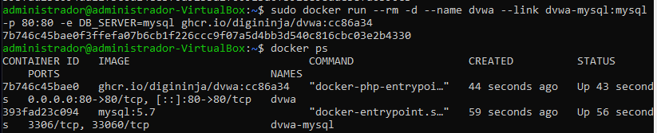
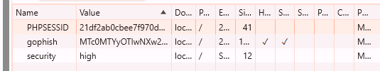
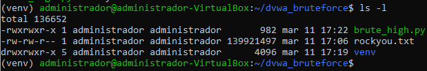
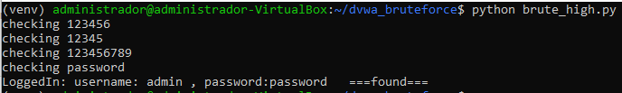

# Damn Vulnerable Web Application (DVWA) con MySQL en Docker

Este proyecto levanta **DVWA** junto con **MySQL 5.7** en contenedores Docker para practicar pruebas de seguridad web.

## **Instalación y Puesta en Marcha**

1. **Descargar las imágenes necesarias de Docker**:
   ```bash
   docker pull mysql:5.7
   docker pull ghcr.io/digininja/dvwa:cc86a34
   ```

2. **Ejecutar MySQL** con credenciales preconfiguradas:
   ```bash
   docker run -d --name dvwa-mysql \
     -e MYSQL_ROOT_PASSWORD=root \
     -e MYSQL_USER=dvwa \
     -e MYSQL_PASSWORD=p@ssw0rd \
     -e MYSQL_DATABASE=dvwa \
     mysql:5.7
   ```

3. **Levantar DVWA** y conectarlo al contenedor de MySQL:
   ```bash
   docker run -d --name dvwa --link dvwa-mysql:mysql -p 80:80 \
     -e DB_SERVER=mysql ghcr.io/digininja/dvwa:cc86a34
   ```

4. **Acceder a la aplicación** en el navegador:
   ```
   http://localhost/login.php
   ```

5. **Configurar la base de datos** haciendo clic en **"Create / Reset Database"**.

6. **Iniciar sesión** con:
   - Usuario: `admin`
   - Contraseña: `password`

Ahora **DVWA** está listo para realizar pruebas de seguridad. 🛡️

### **Captura de la Configuración**
A continuación, se muestra una imagen con la configuración y ejecución de los contenedores:



# Fuerza Bruta en DVWA

## Descripción
Este proyecto realiza un ataque de fuerza bruta contra la aplicación Damn Vulnerable Web Application (DVWA) en el nivel de seguridad alto. Para ello, se ha creado un archivo llamado **`dvwa_bruteforce.php`** que automatiza el proceso de autenticación mediante una lista de contraseñas.

## Ubicación del Archivo
El archivo se encuentra en:
```
assets/dvwa_bruteforce.php
```

## Instalación y Configuración
1. **Se ha creado el archivo y se le han asignado permisos de ejecución:**
   ```bash
   chmod +x assets/dvwa_bruteforce.php
   ```
2. **Se ha ejecutado utilizando el diccionario `rockyou.txt`, el cual ya estaba descargado en el mismo directorio:**
   ```bash
   php assets/dvwa_bruteforce.php rockyou.txt
   ```

## Funcionamiento del Script
- Se conecta con DVWA y extrae el token CSRF dinámicamente.
- Prueba múltiples combinaciones de credenciales utilizando la lista de contraseñas `rockyou.txt`.
- Detecta automáticamente la contraseña correcta y la muestra en pantalla.

## Requisitos
- **PHP instalado en el sistema**
- **DVWA en ejecución** con nivel de seguridad `high`
- **Archivo `rockyou.txt`** como diccionario de contraseñas

## Capturas de Pantalla

### **Cookies en el Navegador**


### **Archivos en el Directorio**


### **Ejecución del Script**


## Notas
- **Si el script no encuentra la contraseña:** Asegúrate de que DVWA está en el nivel `high` y que el `PHPSESSID` es válido.
- **Si necesitas cambiar la lista de contraseñas:** Modifica el archivo `rockyou.txt` o usa otro diccionario.

🔥 **¡Fuerza Bruta exitosa!** 🚀
